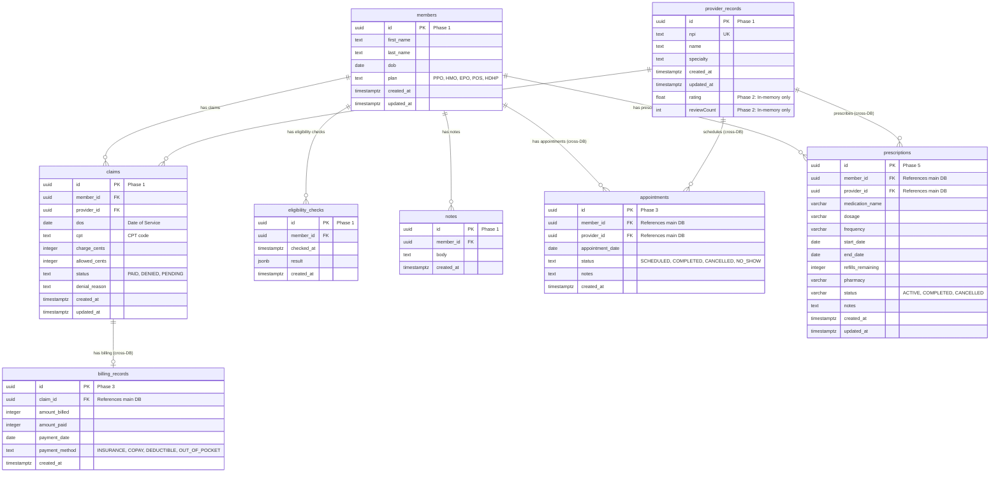

# Database Schema Evolution Across Labs

This document shows how the database schema evolves as you progress through the ClaimSight labs, with each phase adding new tables and capabilities.

---

## 📊 Complete Entity Relationship Diagram



---

## 🗂️ Database Architecture by Phase

### Phase 1: Hasura Cloud
**Database:** `claimsight` (PostgreSQL on Neon/Supabase)
**Lab:** [Phase 1: Hasura Cloud](../labs/phase-1-hasura-cloud/README.md)

**Tables Added:**
- ✅ `members` - Health plan members/patients
- ✅ `provider_records` - Healthcare providers
- ✅ `claims` - Medical claims
- ✅ `eligibility_checks` - Insurance eligibility verification
- ✅ `notes` - Case management notes

**Access:** Hasura auto-generates GraphQL API for all tables with full CRUD operations.

---

### Phase 2: Apollo Federation
**Database:** In-memory data only
**Lab:** [Phase 2: Apollo Federation](../labs/phase-2-apollo-federation/README.md)

**Virtual Fields Added:**
- ✅ `provider_records.rating` - Provider average rating (in-memory)
- ✅ `provider_records.reviewCount` - Total review count (in-memory)
- ✅ `provider_records.reviews` - Array of Review objects (in-memory)

**Access:** Custom Node.js subgraph extends Hasura's `provider_records` type using Apollo Federation `@key` directive. No database tables created.

---

### Phases 3 & 4: Appointments Service
**Database:** `appointments` (Separate PostgreSQL on Neon)
**Labs:**
- [Phase 3: Apollo Server from Scratch](../labs/phase-3-apollo-server/README.md)
- [Phase 4: Add to Federation](../labs/phase-4-add-to-federation/README.md)

**Tables Added:**
- ✅ `appointments` - Scheduled appointments between members and providers
- ✅ `billing_records` - Payment and billing information

**Access:** Custom Apollo Server with manual GraphQL schema. Federated with main database in Phase 4.

**Cross-Database References:**
- `appointments.member_id` → `claimsight.members.id`
- `appointments.provider_id` → `claimsight.provider_records.id`
- `billing_records.claim_id` → `claimsight.claims.id`

---

### Phases 5 & 6: Medications Service
**Database:** `medications` (Separate PostgreSQL on Neon, schema: `medications`)
**Labs:**
- [Phase 5: Spring Boot GraphQL](../labs/phase-5-spring-boot-graphql/README.md)
- [Phase 6: Add Spring Boot to Federation](../labs/phase-6-add-spring-boot-to-federation/README.md)

**Tables Added:**
- ✅ `medications.prescriptions` - Medication prescriptions with dosage, frequency, and refills

**Access:** Spring Boot GraphQL with JPA/Hibernate. Federated with main database in Phase 6.

**Cross-Database References:**
- `prescriptions.member_id` → `claimsight.members.id`
- `prescriptions.provider_id` → `claimsight.provider_records.id`

---

### Phase 7: Hasura DDN
**Database:** Reuses `claimsight` PostgreSQL
**Lab:** [Phase 7: Hasura DDN](../labs/phase-7-hasura-ddn/README.md)

**Tables:** No new tables added

**Architecture Change:**
- Migrates from Hasura v2 (direct database connection) to Hasura DDN v3 (connector-based architecture)
- Uses PostgreSQL connector to access same `claimsight` database
- Metadata defined in `.hml` files instead of JSON

---

### Phase 8: PromptQL + AI
**Database:** Queries existing databases
**Lab:** [Phase 8: PromptQL](../labs/phase-8-promptql/README.md)

**Tables:** No new tables added

**Feature:** Natural language to SQL using OpenAI/Anthropic LLMs to query the existing `claimsight` database.

---

## 🔗 Cross-Database Federation

Apollo Federation enables querying across all three databases as if they were one unified schema:

```graphql
# Query spanning 3 databases + in-memory data
query UnifiedPatientView {
  members(where: {id: {_eq: $memberId}}) {
    # Main DB (claimsight)
    id
    first_name
    last_name

    # Main DB relationships
    claims {
      cpt
      charge_cents
    }

    # Appointments DB (cross-database)
    appointments {
      appointment_date
      provider {
        name
        # In-memory data from Providers subgraph
        rating
        reviewCount
      }
    }

    # Medications DB (cross-database)
    prescriptions {
      medication_name
      dosage
      status
    }
  }
}
```

**How Federation Works:**
1. Apollo Gateway receives the query
2. Gateway breaks query into subqueries for each service
3. Hasura fetches member + claims from `claimsight` DB
4. Appointments service fetches from `appointments` DB
5. Medications service fetches from `medications` DB
6. Providers subgraph adds rating data (in-memory)
7. Gateway merges all results into single response

---

## 📋 Summary Table

| Phase | Database | Schema | Tables Added | Technology | Lab |
|-------|----------|--------|--------------|------------|-----|
| 1 | `claimsight` (Neon) | `public` | 5 tables | Hasura Cloud v2 | [Phase 1](../labs/phase-1-hasura-cloud/README.md) |
| 2 | In-memory | - | Virtual fields | Node.js + Apollo | [Phase 2](../labs/phase-2-apollo-federation/README.md) |
| 3-4 | `appointments` (Neon) | `public` | 2 tables | Node.js + Apollo | [Phase 3](../labs/phase-3-apollo-server/README.md), [Phase 4](../labs/phase-4-add-to-federation/README.md) |
| 5-6 | `medications` (Neon) | `medications` | 1 table | Spring Boot + JPA | [Phase 5](../labs/phase-5-spring-boot-graphql/README.md), [Phase 6](../labs/phase-6-add-spring-boot-to-federation/README.md) |
| 7 | `claimsight` (reused) | `public` | 0 new | Hasura DDN v3 | [Phase 7](../labs/phase-7-hasura-ddn/README.md) |
| 8 | All databases | - | 0 new | PromptQL + OpenAI | [Phase 8](../labs/phase-8-promptql/README.md) |

**Total Tables:** 8 database tables + virtual fields
**Total Databases:** 3 separate PostgreSQL databases
**Total Subgraphs:** 4 GraphQL services (Hasura, Providers, Appointments, Medications)

---

## 🎯 Key Learning Points

1. **Phase 1-2:** Single database with Hasura auto-generation + Apollo Federation extension
2. **Phase 3-4:** Adding custom Apollo Server with separate database
3. **Phase 5-6:** Polyglot architecture (Node.js + Java) with third database
4. **Phase 7:** Modern DDN connector architecture vs direct DB access
5. **Phase 8:** AI-powered natural language queries

This progression teaches you:
- ✅ Auto-generated vs manual GraphQL schemas
- ✅ Multiple database architecture
- ✅ Cross-database entity resolution
- ✅ Polyglot microservices (Go/Node.js/Java)
- ✅ Apollo Federation best practices
- ✅ Hasura v2 vs DDN architecture

---

**Ready to start?** Begin with [Phase 1: Hasura Cloud Basics](../labs/phase-1-hasura-cloud/README.md)!
