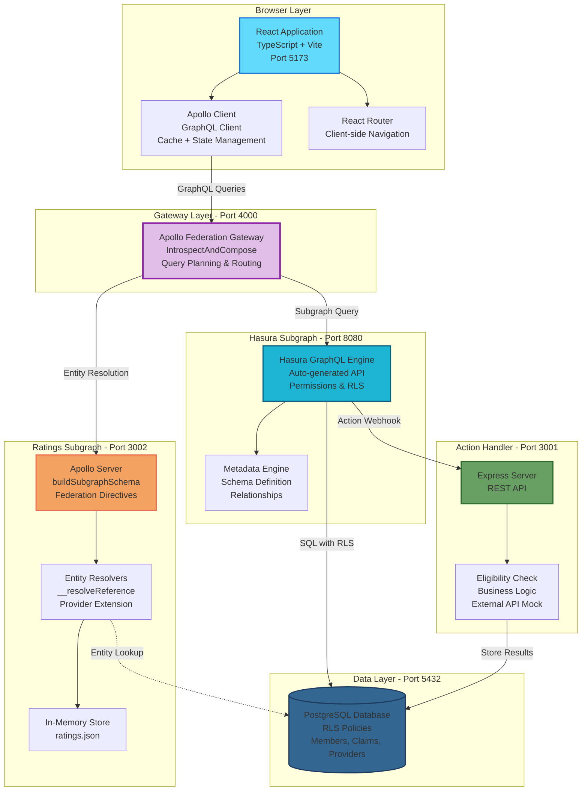
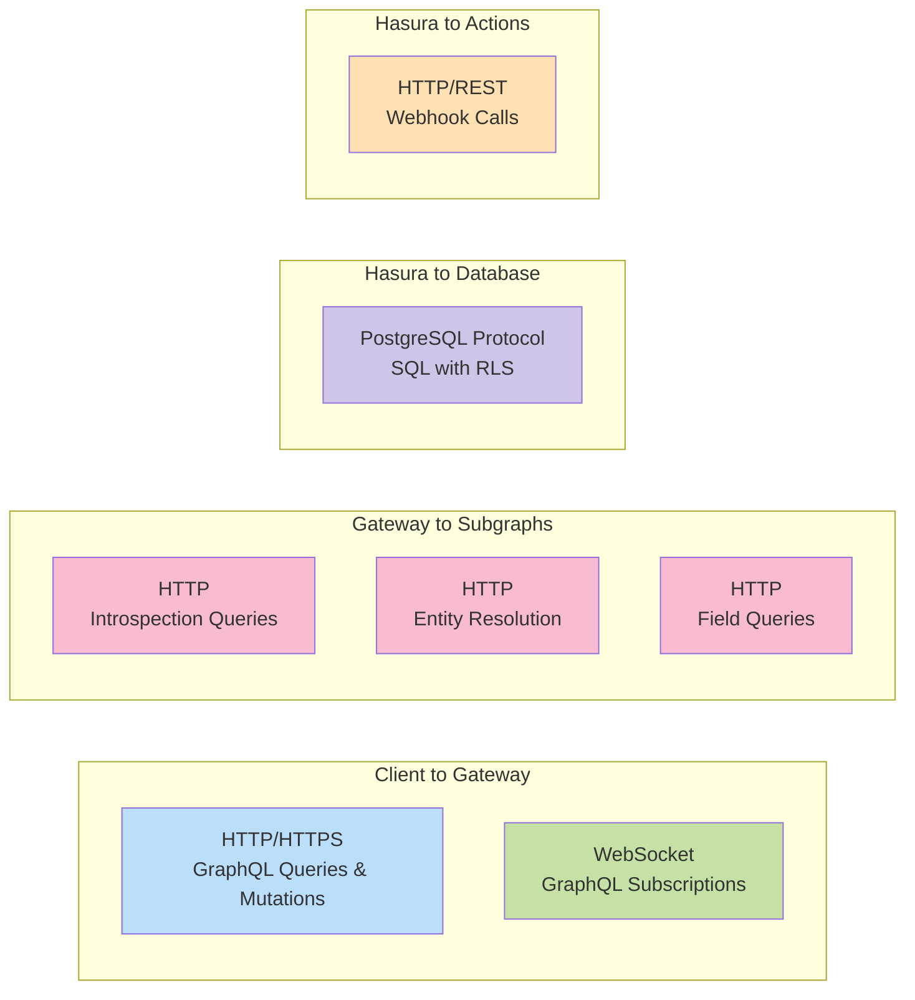
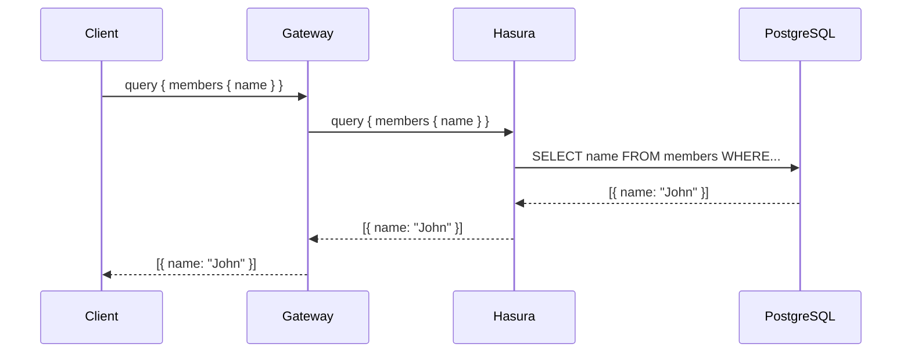
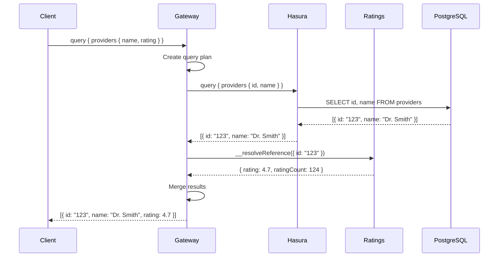
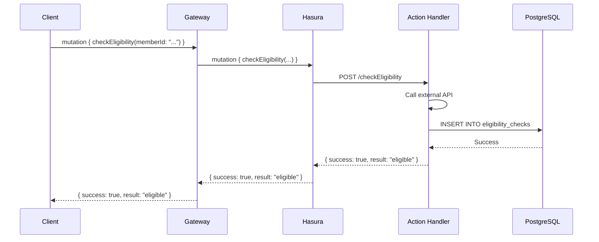
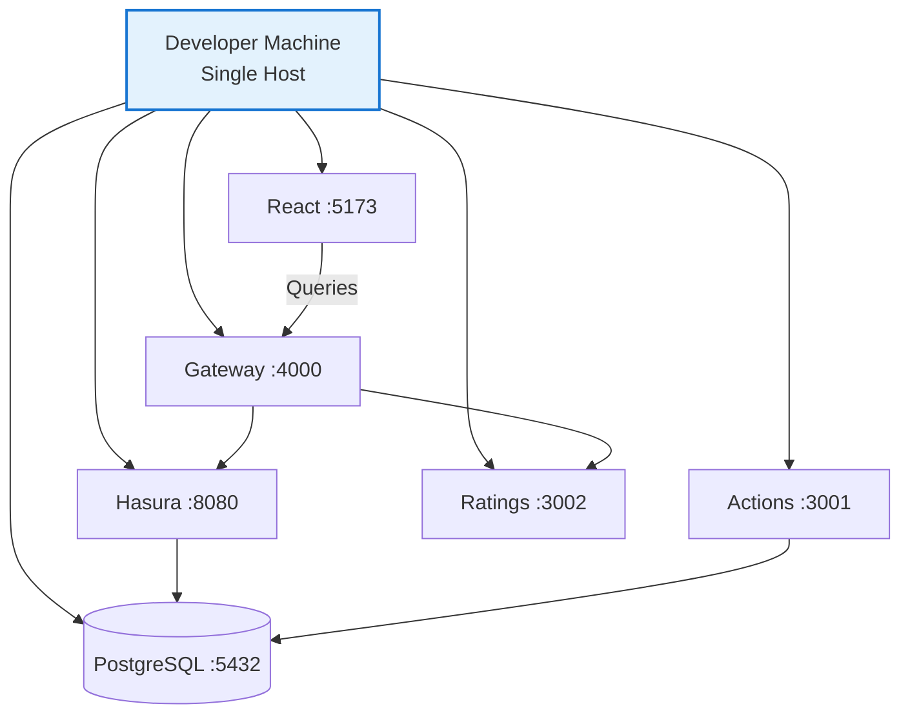
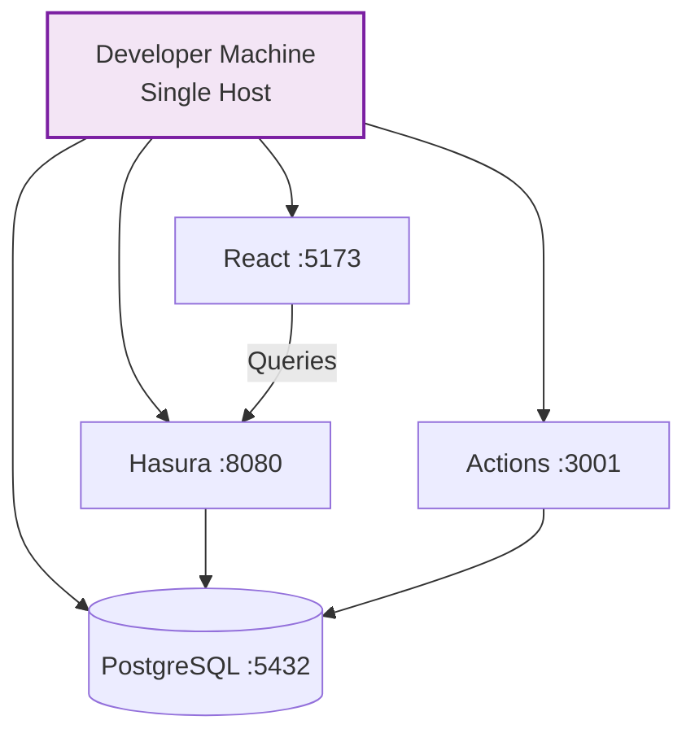
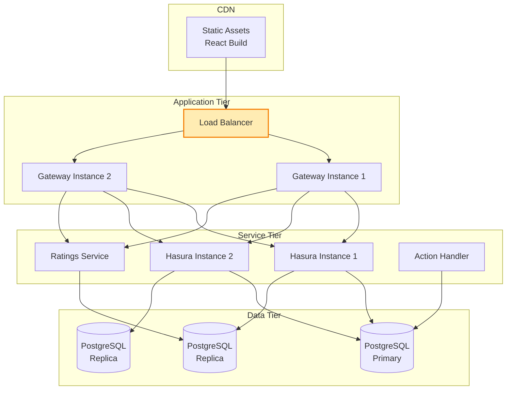

# Component Diagram - Federated Architecture

This diagram shows all components in the ClaimSight federated architecture, including service boundaries, ports, and communication patterns.

## Full System Components

## Communication Protocols

## Port Mapping

| Service | Port | Protocol | Purpose |
|---------|------|----------|---------|
| **React App** | 5173 | HTTP | Development server (Vite) |
| **Apollo Gateway** | 4000 | HTTP/WS | Federated GraphQL endpoint |
| **Hasura Subgraph** | 8080 | HTTP/WS | Core GraphQL API |
| **Action Handler** | 3001 | HTTP | Custom business logic |
| **Ratings Subgraph** | 3002 | HTTP | Provider ratings API |
| **PostgreSQL** | 5432 | PostgreSQL | Database server |

## Data Flow Patterns

### Pattern 1: Simple Query (Hasura Only)

### Pattern 2: Federated Query (Hasura + Ratings)

### Pattern 3: Custom Action

## Component Responsibilities

### React Application
- **UI Rendering**: Claims list, detail views, forms
- **State Management**: Apollo Client cache
- **Routing**: Client-side navigation
- **Role Switching**: Dev mode role simulation

### Apollo Gateway
- **Schema Composition**: Combines Hasura + ratings schemas
- **Query Planning**: Determines optimal execution strategy
- **Entity Resolution**: Links types across subgraphs
- **Response Merging**: Unifies data from multiple sources

### Hasura Subgraph
- **GraphQL API**: Auto-generated from database
- **Permissions**: Role-based access control
- **Real-time**: WebSocket subscriptions
- **Actions**: Delegates to custom handlers

### Ratings Subgraph
- **Type Extension**: Extends Provider with ratings
- **Entity Resolution**: Resolves Provider references
- **Data Management**: In-memory ratings store
- **Federation Compliance**: Apollo Federation v2 spec

### Action Handler
- **Business Logic**: Eligibility checks
- **External APIs**: Payer API integration (mocked)
- **Data Persistence**: Stores action results

### PostgreSQL
- **Data Storage**: Members, claims, providers, notes
- **Row-Level Security**: Database-level permissions
- **JSONB**: Flexible data structures
- **Relationships**: Foreign keys and indexes

## Deployment Modes

### Development (Federated)

**Start Command:** `npm run federated:dev`

### Development (Direct)

**Start Command:** `npm run dev`

### Production (Suggested)

## Technology Stack

| Layer | Technology | Purpose |
|-------|-----------|---------|
| **Frontend** | React 18 + TypeScript | UI components |
| | Apollo Client 3 | GraphQL client |
| | TailwindCSS | Styling |
| | Vite | Build tool |
| **Gateway** | Apollo Gateway | Schema composition |
| | @apollo/gateway | Federation runtime |
| | Express | HTTP server |
| **Subgraphs** | Hasura GraphQL Engine | Primary API |
| | Apollo Server | Ratings API |
| | @apollo/subgraph | Federation support |
| **Actions** | Node.js + Express | Custom logic |
| **Database** | PostgreSQL 15+ | Data persistence |
| | Row-Level Security | Authorization |

## Extension Points

### Adding a New Subgraph

1. Create new Apollo Server with `buildSubgraphSchema`
2. Define schema with federation directives (`@key`, `@external`)
3. Implement `__resolveReference` for entities
4. Add to gateway's subgraph list
5. Gateway auto-composes schema

### Adding a New Action

1. Define action in Hasura metadata
2. Implement handler in action server
3. Configure webhook URL
4. Hasura calls handler on mutation

### Adding a New Table

1. Create table in PostgreSQL
2. Track in Hasura
3. Configure permissions
4. RLS policies applied automatically
5. GraphQL API auto-generated
