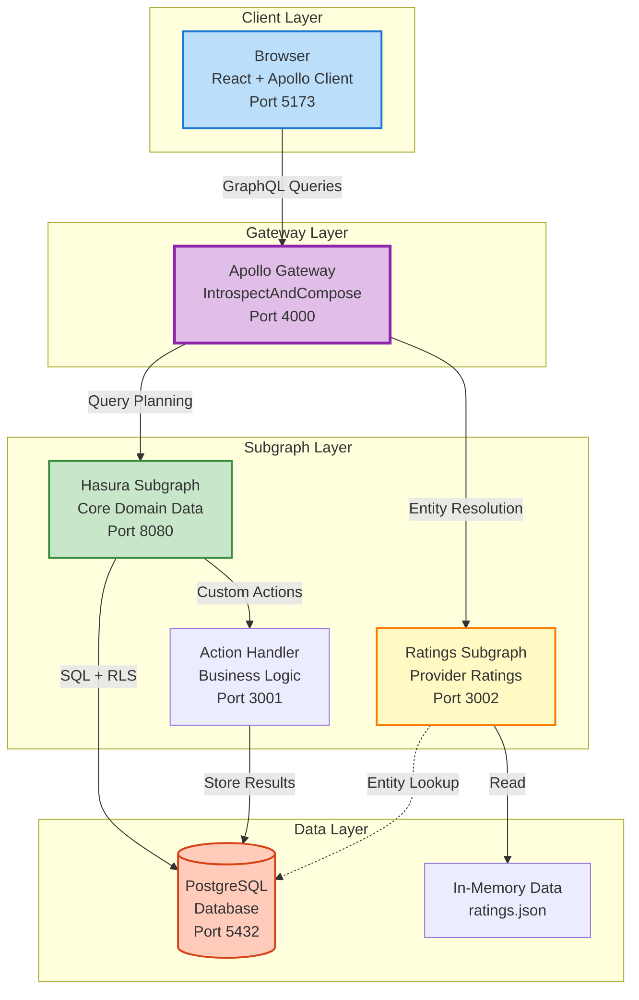
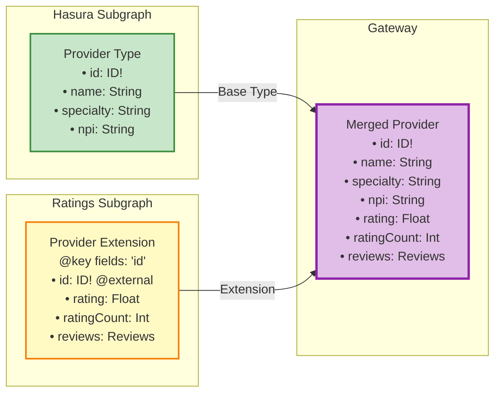
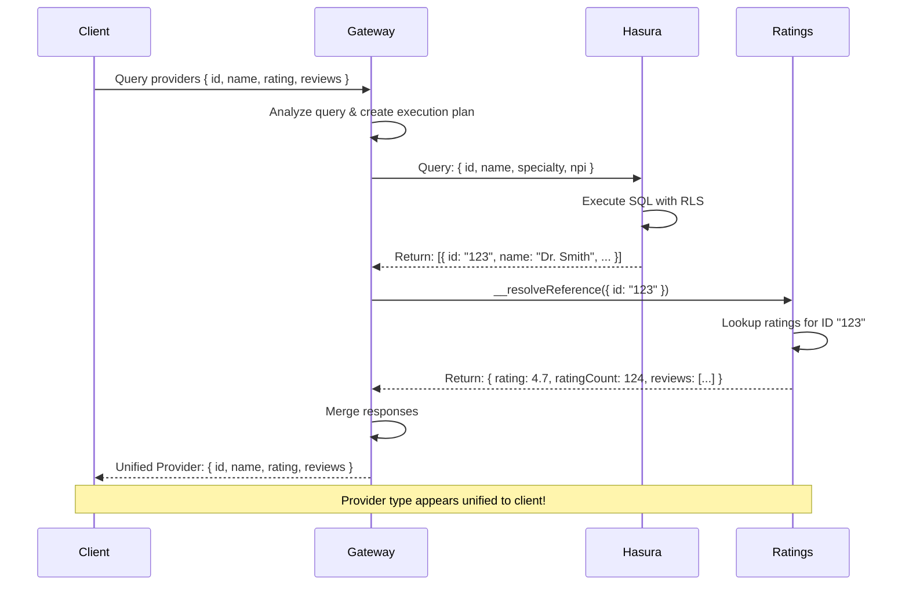
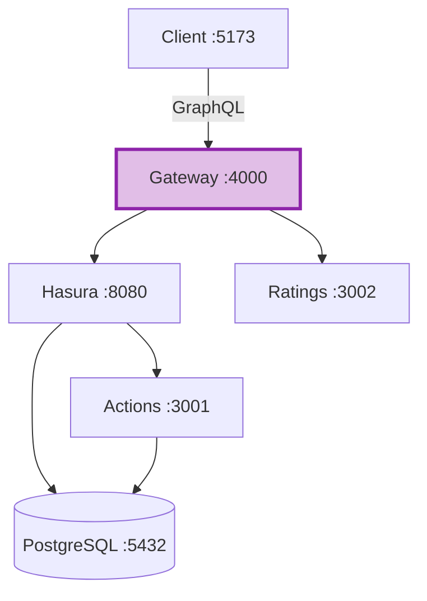
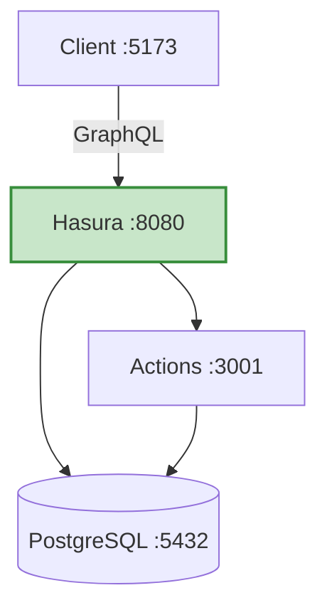

# Apollo Federation Architecture

This diagram shows the complete federated architecture of ClaimSight, including the Apollo Gateway that combines multiple GraphQL services.

## Architecture Diagram



## Entity Extension Flow

How the Provider type is extended across subgraphs:



## Query Execution Flow

Step-by-step execution of a federated query:



## Development Modes

### Federated Mode (Default)

**Command:** `npm run federated:dev`



**Features:**
- Full federation capabilities
- Provider ratings and reviews
- Multiple data sources
- Entity resolution

### Direct Mode (Simple)

**Command:** `npm run dev`



**Features:**
- Simpler setup
- No gateway overhead
- Core functionality only
- Faster startup

## Key Federation Concepts

### 1. Entity References (@key directive)
```graphql
type Provider @key(fields: "id") {
  id: ID! @external
  # ... extended fields
}
```
- Defines how to identify an entity across subgraphs
- Gateway uses this to resolve entity references

### 2. IntrospectAndCompose
- Development-friendly composition mode
- Auto-discovers subgraph schemas on startup
- No manual schema composition needed
- Gateway introspects each subgraph's schema

### 3. Entity Resolution (__resolveReference)
```typescript
Provider: {
  __resolveReference(ref: { id: string }) {
    return ratingsData[ref.id];
  }
}
```
- Special resolver that fetches entity by key
- Gateway calls this when extending types

### 4. Query Planning
- Gateway analyzes query requirements
- Determines which subgraphs to query
- Optimizes execution order
- Merges results efficiently

## Benefits of Federation

✅ **Service Separation** - Teams can own independent GraphQL services
✅ **Type Extension** - Add fields to existing types without modifying original service
✅ **Unified Schema** - Single GraphQL endpoint for clients
✅ **Independent Deployment** - Subgraphs can deploy separately
✅ **Data Source Flexibility** - Each subgraph can use different databases

## Apollo Studio Visualization

For production environments, Apollo Studio provides:

- **Schema Registry** - Track schema changes over time
- **Query Performance** - Monitor field-level performance
- **Field Usage** - See which fields are actually used
- **Supergraph Composition** - Validate schema composition before deployment
- **Operation Metrics** - Track query execution across subgraphs

**Setup:** See `FEDERATION_GUIDE.md` for Apollo Studio integration steps.
