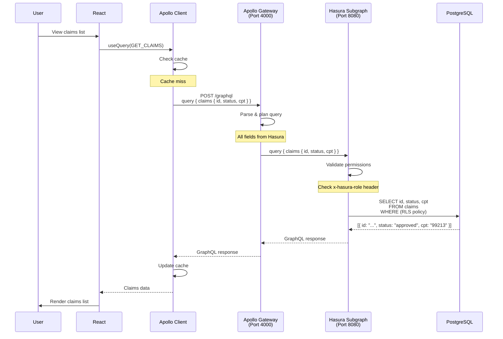
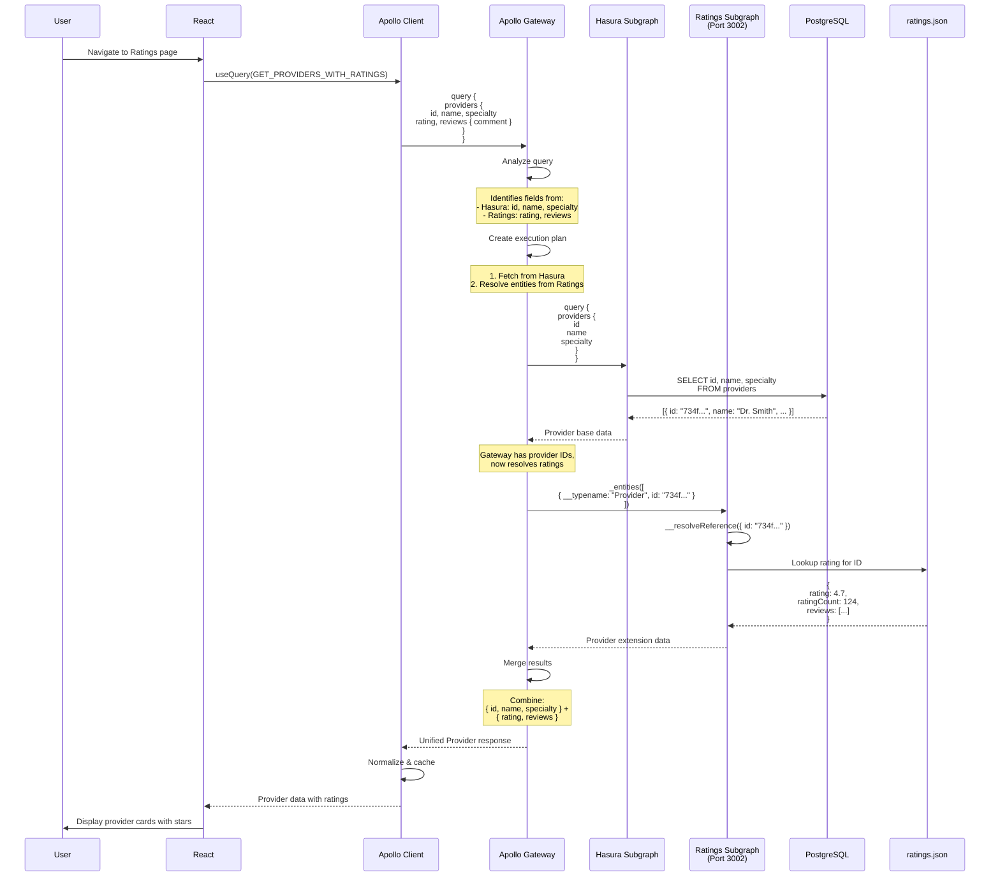
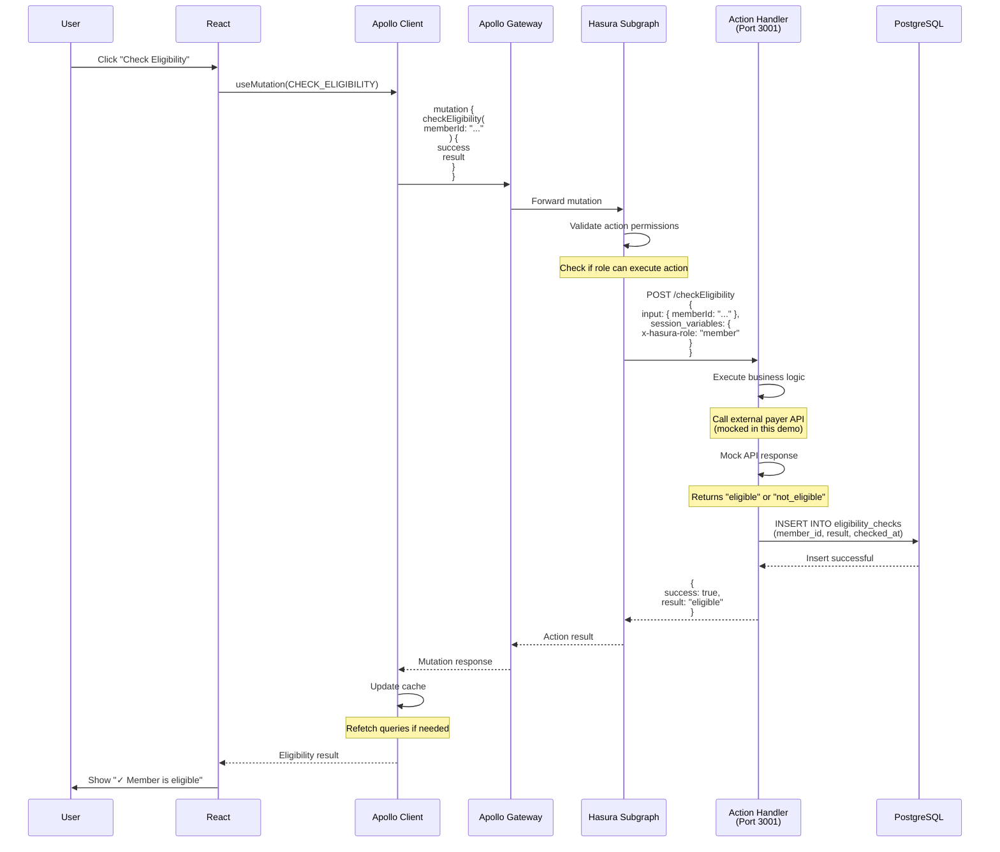
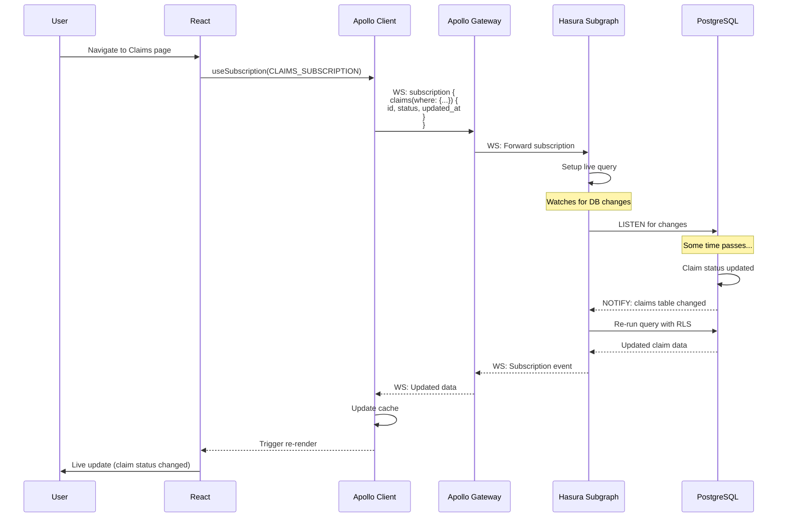
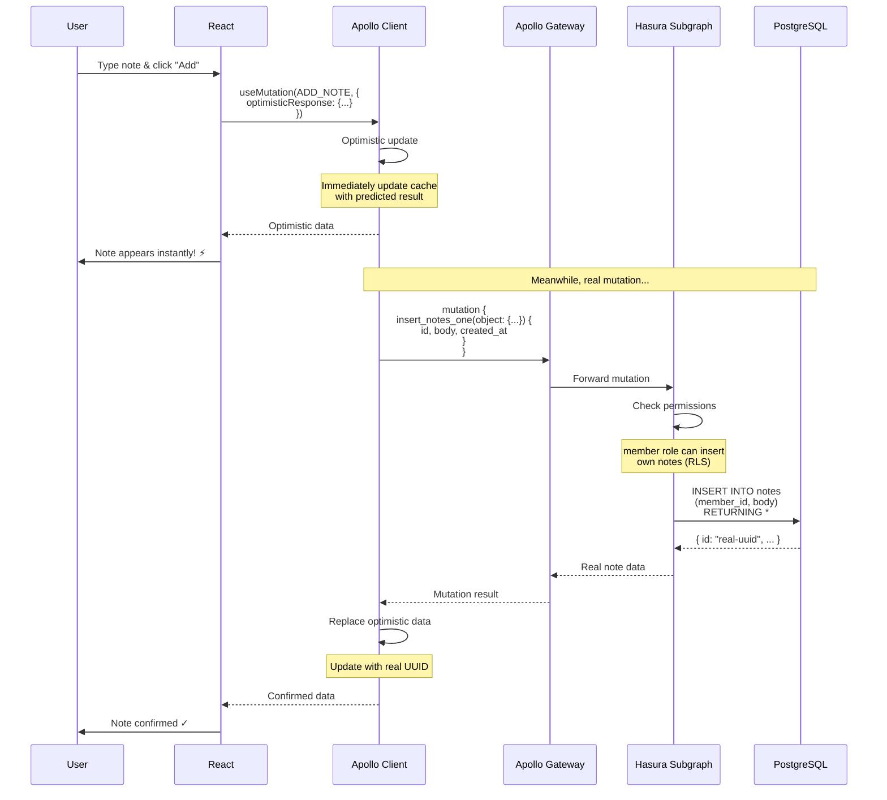
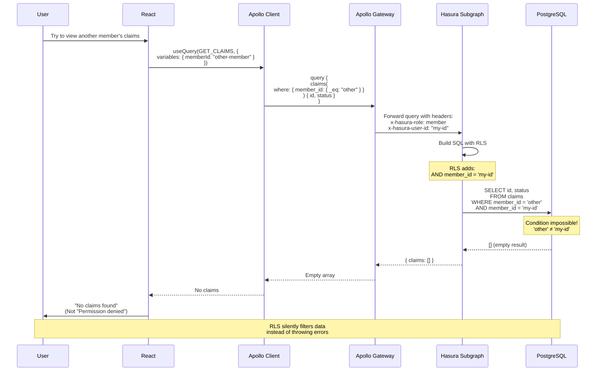
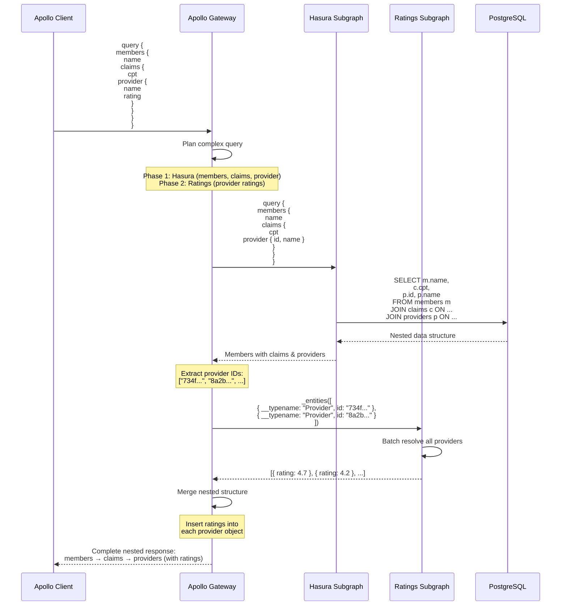

# Sequence Diagrams - Federated Queries

This document shows detailed sequence diagrams for various query patterns in the ClaimSight federated architecture.

## 1. Simple Query (Hasura Only)

When querying data that exists entirely in Hasura, the gateway acts as a pass-through.



## 2. Federated Query (Hasura + Ratings)

When querying the Provider type with rating fields, the gateway orchestrates calls to both subgraphs.



## 3. Custom Action (Eligibility Check)

When executing a mutation that triggers a Hasura action, the flow involves the action handler.



## 4. Real-time Subscription (Claims Updates)

Subscriptions flow through the gateway to Hasura's WebSocket connection.



## 5. Optimistic UI Update (Add Note)

Shows Apollo Client's optimistic update with federation.



## 6. Error Handling (Permission Denied)

Shows what happens when RLS blocks unauthorized access.



## 7. Multi-Level Nested Query

Shows how the gateway handles complex nested queries across relationships.



## Key Patterns Summary

### Pattern 1: Pass-Through
- Query only Hasura fields
- Gateway forwards request
- Single database query
- Fastest performance

### Pattern 2: Entity Resolution
- Query federated fields
- Gateway calls multiple subgraphs
- Uses `__resolveReference`
- Automatic merging

### Pattern 3: Custom Actions
- Mutation triggers webhook
- Business logic in Node.js
- Database writes via action
- Return to gateway

### Pattern 4: Real-Time
- WebSocket subscription
- Database LISTEN/NOTIFY
- Live updates via gateway
- Cache invalidation

### Pattern 5: Optimistic UI
- Immediate cache update
- Background mutation
- Rollback on error
- Better UX

### Pattern 6: Security
- RLS at database level
- Silent filtering
- No explicit errors
- Defense in depth

## Performance Characteristics

| Pattern | Latency | Complexity | Use Case |
|---------|---------|------------|----------|
| Pass-Through | ~10ms | Low | Basic CRUD |
| Entity Resolution | ~25ms | Medium | Federated data |
| Custom Actions | ~100ms | High | External APIs |
| Subscriptions | ~5ms | Medium | Real-time updates |
| Optimistic | ~0ms (perceived) | Medium | Better UX |

## Debugging Tips

### Enable Gateway Logging
```typescript
const gateway = new ApolloGateway({
  debug: true  // Shows query plans
});
```

### Check Query Plan
```graphql
query @explain {
  providers { name, rating }
}
```

### Monitor Performance
- Gateway logs show which subgraph handled each field
- Apollo Studio shows field-level performance
- Browser DevTools Network tab shows GraphQL requests
