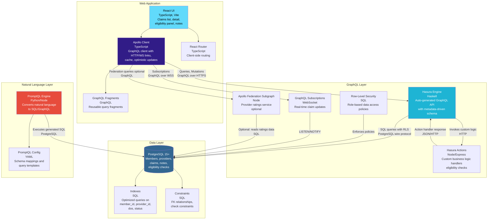

# ClaimSight Component Diagram

```mermaid
graph TB
    subgraph Web Application
        ApolloClient[Apollo Client<br/>TypeScript<br/>GraphQL client with HTTP/WS links,<br/>cache, optimistic updates]
        ReactApp[React UI<br/>TypeScript, Vite<br/>Claims list, detail,<br/>eligibility panel, notes]
        Router[React Router<br/>TypeScript<br/>Client-side routing]
        Fragments[GraphQL Fragments<br/>GraphQL<br/>Reusable query fragments]
    end

    subgraph GraphQL Layer
        HasuraEngine[Hasura Engine<br/>Haskell<br/>Auto-generated GraphQL API<br/>with metadata-driven schema]
        HasuraActions[Hasura Actions<br/>Node/Express<br/>Custom business logic handlers<br/>eligibility checks]
        HasuraRLS[Row-Level Security<br/>SQL<br/>Role-based data access policies]
        HasuraSubs[GraphQL Subscriptions<br/>WebSocket<br/>Real-time claim updates]
        ApolloSubgraph[Apollo Federation Subgraph<br/>Node<br/>Provider ratings service<br/>optional]
    end

    subgraph Data Layer
        Postgres[(PostgreSQL 15+<br/>Members, providers,<br/>claims, notes,<br/>eligibility checks)]
        Indexes[Indexes<br/>SQL<br/>Optimized queries on<br/>member_id, provider_id,<br/>dos, status]
        Constraints[Constraints<br/>SQL<br/>FK relationships,<br/>check constraints]
    end

    subgraph Natural Language Layer
        PromptQLEngine[PromptQL Engine<br/>Python/Node<br/>Converts natural language<br/>to SQL/GraphQL]
        PromptQLConfig[PromptQL Config<br/>YAML<br/>Schema mappings and<br/>query templates]
    end

    ReactApp --> ApolloClient
    ReactApp --> Router
    ApolloClient --> Fragments

    ApolloClient -->|Queries, Mutations<br/>GraphQL over HTTPS| HasuraEngine
    ApolloClient -->|Subscriptions<br/>GraphQL over WSS| HasuraSubs
    ApolloClient -->|Federation queries optional<br/>GraphQL| ApolloSubgraph

    HasuraEngine -->|SQL queries with RLS<br/>PostgreSQL wire protocol| Postgres
    HasuraActions -->|Action handler response<br/>JSON/HTTP| HasuraEngine
    HasuraEngine -->|Invokes custom logic<br/>HTTP| HasuraActions
    HasuraRLS -->|Enforces policies| Postgres
    HasuraSubs -->|LISTEN/NOTIFY| Postgres

    ApolloSubgraph -->|Optional: reads ratings data<br/>SQL| Postgres

    PromptQLEngine -->|Executes generated SQL<br/>PostgreSQL| Postgres
    PromptQLEngine --> PromptQLConfig

    Postgres --> Indexes
    Postgres --> Constraints

    style ApolloClient fill:#311C87,color:#fff
    style ReactApp fill:#61DAFB,color:#000
    style HasuraEngine fill:#1EB4D4,color:#fff
    style Postgres fill:#336791,color:#fff
    style PromptQLEngine fill:#E74C3C,color:#fff
```
