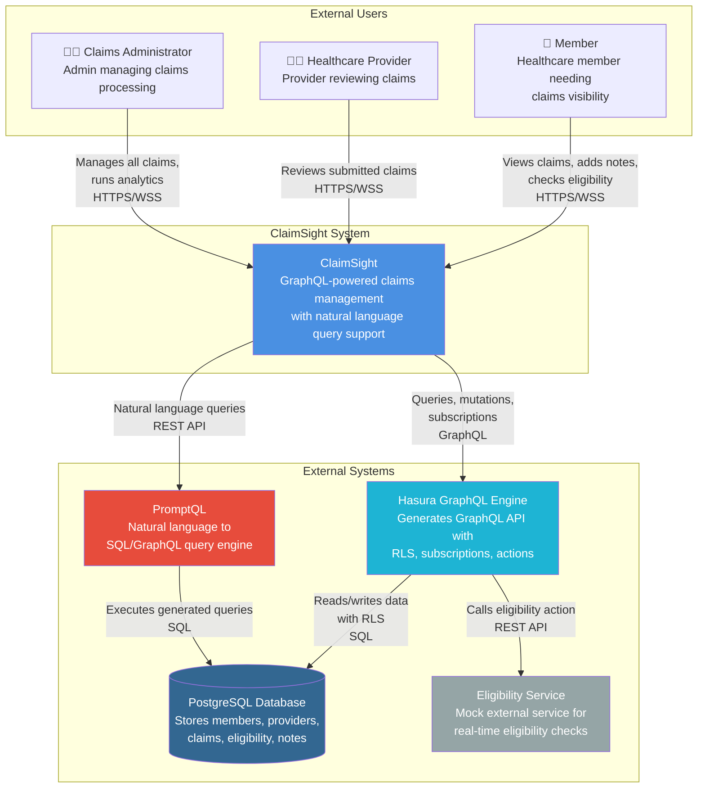

# ClaimSight System Context Diagram

```mermaid
graph TB
    subgraph External Users
        Member[👤 Member<br/>Healthcare member needing<br/>claims visibility]
        Provider[👨‍⚕️ Healthcare Provider<br/>Provider reviewing claims]
        Admin[👨‍💼 Claims Administrator<br/>Admin managing claims processing]
    end

    subgraph ClaimSight System
        App[ClaimSight<br/>GraphQL-powered claims management<br/>with natural language query support]
    end

    subgraph External Systems
        Postgres[(PostgreSQL Database<br/>Stores members, providers,<br/>claims, eligibility, notes)]
        Hasura[Hasura GraphQL Engine<br/>Generates GraphQL API with<br/>RLS, subscriptions, actions]
        EligibilityAPI[Eligibility Service<br/>Mock external service for<br/>real-time eligibility checks]
        PromptQL[PromptQL<br/>Natural language to<br/>SQL/GraphQL query engine]
    end

    Member -->|Views claims, adds notes,<br/>checks eligibility<br/>HTTPS/WSS| App
    Provider -->|Reviews submitted claims<br/>HTTPS/WSS| App
    Admin -->|Manages all claims,<br/>runs analytics<br/>HTTPS/WSS| App

    App -->|Queries, mutations,<br/>subscriptions<br/>GraphQL| Hasura
    App -->|Natural language queries<br/>REST API| PromptQL

    Hasura -->|Reads/writes data<br/>with RLS<br/>SQL| Postgres
    Hasura -->|Calls eligibility action<br/>REST API| EligibilityAPI
    PromptQL -->|Executes generated queries<br/>SQL| Postgres

    style App fill:#4A90E2,color:#fff
    style Postgres fill:#336791,color:#fff
    style Hasura fill:#1EB4D4,color:#fff
    style EligibilityAPI fill:#95A5A6,color:#fff
    style PromptQL fill:#E74C3C,color:#fff
```
