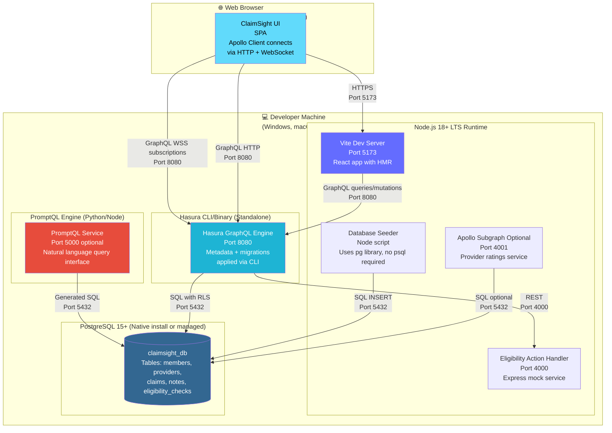

# ClaimSight Deployment Diagram (Cross-Platform, No Docker)



## Cross-Platform Setup

**Scripts Available:**
- PowerShell (`.ps1`) and Bash (`.sh`) scripts
- `npm run setup`, `seed`, `hasura:apply`, `dev`
- No Docker, no symlinks, no Bash-only tools
- Works on Windows corporate laptops, macOS, Linux

**Environment:**
- `.env` file with connection strings
- `cross-env` for OS-agnostic env vars
- `concurrently` for parallel process management

## Installation by Platform

### PostgreSQL Installation

| Platform | Installation Method |
|----------|-------------------|
| **Windows** | PostgreSQL installer or `choco install postgresql` |
| **macOS** | `brew install postgresql@15` |
| **Linux** | `apt install postgresql-15` or `yum install postgresql15-server` |

**Connection managed via `.env`:**
```
PGHOST=localhost
PGPORT=5432
PGUSER=postgres
PGPASSWORD=your_password
PGDATABASE=claimsight_db
```

### Hasura CLI Installation

| Platform | Installation Method |
|----------|-------------------|
| **Windows** | Scoop: `scoop install hasura-cli` or [direct binary download](https://hasura.io/docs/latest/hasura-cli/install-hasura-cli/) |
| **macOS** | `brew install hasura-cli` |
| **Linux** | `curl -L https://github.com/hasura/graphql-engine/raw/stable/cli/get.sh \| bash` |

**Metadata/migrations:**
- Stored in `hasura/` folder
- Applied via: `hasura metadata apply && hasura migrate apply`
