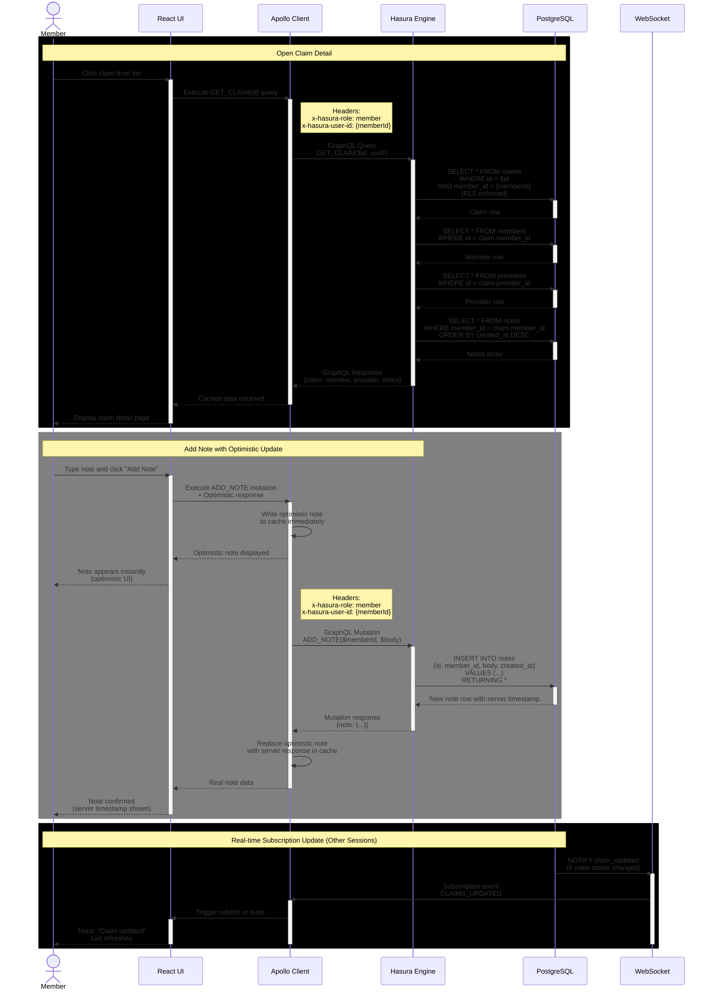

# Sequence: Open Claim Detail & Add Note with Optimistic Update

```mermaid
sequenceDiagram
    actor Member
    participant UI as React UI
    participant Apollo as Apollo Client
    participant Hasura as Hasura Engine
    participant DB as PostgreSQL
    participant WS as WebSocket

    rect black
        Note over Member,DB: Open Claim Detail
        Member->>UI: Click claim from list
        activate UI
        UI->>Apollo: Execute GET_CLAIM(id) query
        activate Apollo

        Note right of Apollo: Headers:<br/>x-hasura-role: member<br/>x-hasura-user-id: {memberId}
        Apollo->>Hasura: GraphQL Query<br/>GET_CLAIM($id: uuid!)
        activate Hasura

        Hasura->>DB: SELECT * FROM claims<br/>WHERE id = $id<br/>AND member_id = {memberId}<br/>(RLS enforced)
        activate DB
        DB-->>Hasura: Claim row
        deactivate DB

        Hasura->>DB: SELECT * FROM members<br/>WHERE id = claim.member_id
        activate DB
        DB-->>Hasura: Member row
        deactivate DB

        Hasura->>DB: SELECT * FROM providers<br/>WHERE id = claim.provider_id
        activate DB
        DB-->>Hasura: Provider row
        deactivate DB

        Hasura->>DB: SELECT * FROM notes<br/>WHERE member_id = claim.member_id<br/>ORDER BY created_at DESC
        activate DB
        DB-->>Hasura: Notes array
        deactivate DB

        Hasura-->>Apollo: GraphQL Response<br/>{claim, member, provider, notes}
        deactivate Hasura
        Apollo-->>UI: Cached data returned
        deactivate Apollo
        UI-->>Member: Display claim detail page
        deactivate UI
    end

    rect grey
        Note over Member,Hasura: Add Note with Optimistic Update
        Member->>UI: Type note and click "Add Note"
        activate UI
        UI->>Apollo: Execute ADD_NOTE mutation<br/>+ Optimistic response
        activate Apollo

        Apollo->>Apollo: Write optimistic note<br/>to cache immediately
        Apollo-->>UI: Optimistic note displayed
        UI-->>Member: Note appears instantly<br/>(optimistic UI)

        Note right of Apollo: Headers:<br/>x-hasura-role: member<br/>x-hasura-user-id: {memberId}
        Apollo->>Hasura: GraphQL Mutation<br/>ADD_NOTE($memberId, $body)
        activate Hasura

        Hasura->>DB: INSERT INTO notes<br/>(id, member_id, body, created_at)<br/>VALUES (...)<br/>RETURNING *
        activate DB
        DB-->>Hasura: New note row with server timestamp
        deactivate DB

        Hasura-->>Apollo: Mutation response<br/>{note: {...}}
        deactivate Hasura

        Apollo->>Apollo: Replace optimistic note<br/>with server response in cache
        Apollo-->>UI: Real note data
        deactivate Apollo
        UI-->>Member: Note confirmed<br/>(server timestamp shown)
        deactivate UI
    end

    rect black
        Note over DB,Member: Real-time Subscription Update (Other Sessions)
        DB->>WS: NOTIFY claim_updated<br/>(if claim status changed)
        activate WS
        WS->>Apollo: Subscription event<br/>CLAIMS_UPDATED
        activate Apollo
        Apollo->>UI: Trigger refetch or toast
        activate UI
        UI-->>Member: Toast: "Claim updated"<br/>List refreshes
        deactivate UI
        deactivate Apollo
        deactivate WS
    end
```
